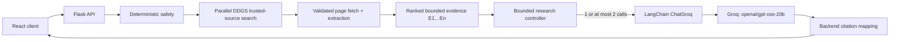

<p align="center"></p>
<h1 align="center">MediVita</h1>
<p align="center"><strong>Health information, grounded in sources you choose.</strong></p>

MediVita is a stateless React and Flask health-information companion. It supports a credential-free deterministic demo and an opt-in connected mode that retrieves actual pages from user-enabled sources before producing a bounded, structured synthesis. It is informational—not a diagnostic, triage, scoring, or treatment product.

## Capabilities

- Source-controlled chat using Healthline, Cleveland Clinic, Mayo Clinic, and WebMD
- A structured, non-diagnostic Health Check using the same grounded workflow
- Live category-based health news with actual publisher URLs in connected mode
- Browser-local conversations and preferences; no database or server-side user history
- Deterministic urgent-signal messaging independent of the model
- Strict trusted-host URL validation, redirect checks, bounded page reads, and evidence-ID citation mapping
- Live, expandable research activity based on operational backend events—not model reasoning
- Preserved credential-free demo mode with explicitly labeled homepage references

## Architecture



Connected chat and Health Check use one model call when evidence is sufficient. The first structured decision may request at most four targeted searches against enabled sources; one final call then completes the response. There is no third round, autonomous loop, vector database, local model, or automatic cross-provider fallback. See [architecture.md](docs/architecture.md).

## Stack

| Layer | Technology |
| --- | --- |
| Frontend | React 18, TypeScript, Vite, Tailwind CSS, Vitest |
| API | Python 3.12, Flask, Gunicorn, httpx |
| Research | DDGS, Beautiful Soup, LangChain, `langchain-groq`, optional `langchain-openrouter`, Pydantic |
| Quality | ESLint, TypeScript strict mode, Ruff, pytest, GitHub Actions |

## Run in demo mode

Prerequisites: Node.js 22+, npm, and Python 3.12+.

```bash
python -m venv .venv
# Windows: .venv\Scripts\activate
# macOS/Linux: source .venv/bin/activate
python -m pip install -r backend/requirements.txt
python backend/run.py
```

In another terminal:

```bash
cd frontend
npm install
npm run dev
```

Open `http://localhost:5173`. Demo mode requires no credentials.

## Enable connected mode

Copy `.env.example` to `.env`, then set:

```dotenv
LLM_PROVIDER=groq
SEARCH_PROVIDER=duckduckgo
NEWS_PROVIDER=duckduckgo
GROQ_API_KEY=your_key_here
```

`backend/run.py` loads the repository-root `.env` with `override=False`, so process environment variables take precedence. The primary connected model is Groq's `openai/gpt-oss-20b`, with low reasoning effort and hidden reasoning output.

OpenRouter remains available only as an explicit secondary adapter: set `LLM_PROVIDER=openrouter` and configure its variables. MediVita never automatically falls back from Groq to OpenRouter or between models.

Important runtime variables are documented in [.env.example](.env.example). Retrieval, page, evidence, cache, Groq/OpenRouter, and frontend timeouts are bounded and configurable. Vite variables must be present in the frontend process/build environment; their code defaults are suitable for local development.

DDGS discovery tries text engines individually in `DDGS_TEXT_BACKENDS` order and news engines individually in `DDGS_NEWS_BACKENDS` order. A blocked or empty engine falls through to the next engine; valid URLs must still pass the existing trusted-domain or publisher allowlist checks.

## Docker

```bash
docker compose up --build
```

Open `http://localhost:8080`. Compose passes provider/model/limit settings at runtime and builds the browser client with a 45-second request timeout. Gunicorn uses a 60-second worker timeout.

## Verification

```bash
cd frontend
npm run lint
npm run typecheck
npm test
npm run build

cd ../backend
ruff check .
pytest
```

All automated provider tests use mocks and require neither credentials nor network access. After deliberately starting connected mode, an optional synthetic smoke check is available:

```bash
python backend/scripts/connected_smoke.py
```

Do not use personal or identifying health information in development or smoke checks.

To diagnose search discovery without invoking Groq, run this with synthetic text:

```bash
python backend/scripts/ddgs_diagnostic.py --source-id mayo-clinic --query "general sleep information"
```

The command reports only backend names, result counts, trusted-result counts, and safe exception types.

## API

| Method | Endpoint | Purpose |
| --- | --- | --- |
| GET | `/api/health` | Status plus provider/model metadata without secrets |
| GET | `/api/sources` | Supported medical sources |
| POST | `/api/chat` | Structured grounded health information |
| POST | `/api/chat/stream` | NDJSON chat result plus live operational research trace |
| POST | `/api/health-check` | Non-diagnostic structured summary |
| POST | `/api/health-check/stream` | NDJSON Health Check result plus live operational research trace |
| GET | `/api/news` | Demo or live normalized health news |

External response shapes and `SourceReference` remain stable. See [api.md](docs/api.md).

The frontend prefers the streaming routes and falls back to the original JSON routes when streaming is unavailable before a result arrives. Completed traces are stored with new browser-local conversations as optional response metadata; older saved conversations remain compatible. Trace events describe externally observable operations such as trusted search, page/snippet retrieval, evidence counts, provider/model selection, citations, rounds, and elapsed time. They never contain prompts, raw evidence, system messages, hidden reasoning, or chain-of-thought.

## Privacy and safety

- MediVita does not diagnose, score health, promise safety, or name a country-specific emergency number.
- The server does not store conversations, final answers, prompts, or health descriptions.
- Search/page/news results use a process-local TTL cache; user text and model answers are not cached.
- Logs contain provider types, timings, counts, rounds, and generated request IDs—not prompts, page bodies, histories, or keys.
- Connected citations originate only from validated retrieved evidence. Valid model-selected IDs map exactly; if the model supplies no valid IDs, the backend cites up to three ranked, enabled evidence items from that same model context.

Production deployments still need authentication, request rate limiting, privacy review, observability, and a formal safety evaluation. See [SECURITY.md](SECURITY.md).

## License

MIT — see [LICENSE](LICENSE).
