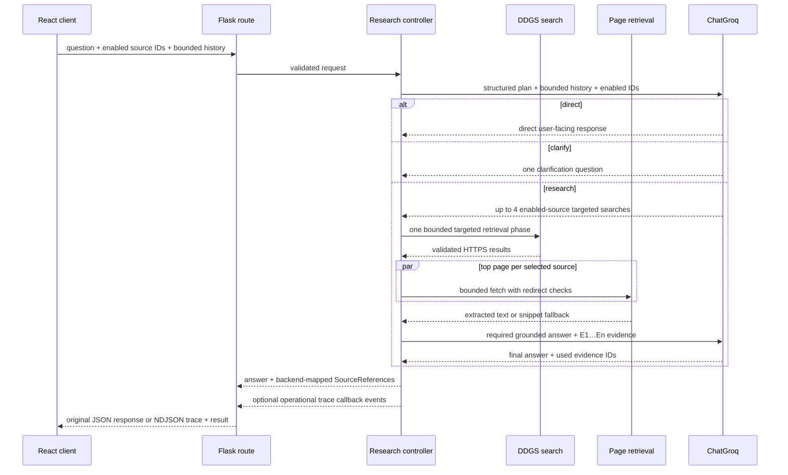

# MediVita Architecture

## Modes and boundaries

MediVita is stateless. The React client keeps conversations and preferences in browser storage; Flask receives only the bounded data required for a request. Demo mode is deterministic and credential-free. Primary connected mode uses `LLM_PROVIDER=groq`, `SEARCH_PROVIDER=duckduckgo`, and optionally `NEWS_PROVIDER=duckduckgo` for live news. OpenRouter remains explicitly selectable as a secondary adapter.

Routes validate HTTP data and delegate. Services own business rules. Providers isolate DDGS, Groq, and optional OpenRouter access. Source adapters remain the source of truth for stable IDs, display names, and trusted domains.

## Connected research flow

Connected Chat performs exactly one planner call. `direct` and `clarify` stop with no retrieval and no citations. `research` performs one targeted retrieval phase and exactly one grounded final-answer call, for a hard ceiling of two model calls. The raw user message is never used as an automatic search query, disabled source IDs are filtered again by the controller, and there is no Chat `search_more` or third call. Health Check deliberately retains its existing initial retrieval, sufficiency decision, optional bounded follow-up retrieval, and required-final second call.

## Observable research traces

Chat and Health Check accept an optional request-local `ResearchTraceEmitter`. Existing services, providers, retrieval, and the bounded controller emit normalized operational events while performing their usual work; instrumentation does not repeat a search, fetch, evidence pass, or model call. Without an emitter, the original JSON endpoints behave as before.

`POST /api/chat/stream` and `POST /api/health-check/stream` run the same service methods and serialize trace updates, the final existing response, and completion as newline-delimited JSON. Stable event IDs let the client replace running events with their completed state. The client persists the optional final trace alongside new browser-local response data and gracefully renders old conversations without it.

Trace fields are allowlisted and bounded. They may include stage/status, a friendly planning outcome, tool, source, safe domain-restricted query, actual contributing DDGS backend, counts, retrieval type, provider/model, research round, and elapsed time. They never contain authorization data, prompts, histories, planner explanations, raw page/evidence content, system messages, model output internals, hidden reasoning, or chain-of-thought. Demo mode reports only that a deterministic response ran with no external tools.

## Retrieval security and evidence

Each enabled source is searched concurrently with `site:<domain>` and a small worker pool. Inside each source job, DDGS text backends are attempted individually and sequentially in configurable order. Exceptions, malformed results, or an empty valid result set fall through to the next backend; enough valid results stop further attempts. Results must use HTTPS and an exact trusted hostname or subdomain. Userinfo, unexpected ports, IP literals, lookalike suffixes, and non-HTTPS URLs are rejected.

The top result per source is fetched with explicit timeouts, a named user agent, manual redirect handling, hostname validation before every request and after every redirect, a redirect ceiling, HTML content-type enforcement, and a maximum response size. Individual source failures do not fail successful peers. Beautiful Soup removes non-content elements; lexical overlap ranks compact chunks. A failed or empty page extraction falls back to the DDGS snippet.

Evidence is request-local and receives backend-owned IDs (`E1`, `E2`, …). It carries the source ID/name/domain, title, validated URL, snippet, compact content, originating query, and retrieval type. Follow-up Health Check evidence is canonical-URL deduplicated and appended within the global character cap. The grounded-answer model sees evidence IDs but not authority to create citations. The backend maps valid model-selected IDs exactly. If none are valid, it deterministically maps up to three ranked items from the evidence actually supplied to that model call, after rechecking the enabled source, trusted HTTPS domain, and canonical URL. A researched connected answer is never returned with an empty source list; direct and clarification responses intentionally return no sources.

## LangChain and LLM providers

Primary connected mode composes `ChatGroq` with `ChatPromptTemplate`, bounded message history, Pydantic JSON-schema output, low reasoning effort, hidden reasoning, and low retries. The default model is `openai/gpt-oss-20b`. Chat uses separate minimal plan and grounded-answer schemas; the plan contains only action, intent, direct/clarification text, and bounded source/query pairs—never a reasoning field. Health Check retains its distinct answer and research-decision schemas through the same bounded controller.

`ChatOpenRouter` remains available only when `LLM_PROVIDER=openrouter` is explicitly configured. The application never automatically switches from Groq to OpenRouter.

## News

Connected news uses DDGS `.news()` independently from web evidence search. News backends are attempted one at a time in configurable order, so one blocked engine does not discard results from another. Category-specific queries are run against a maintained reputable publisher/domain allowlist. Only actual validated article URLs are returned. If no connected article survives validation, the API returns `NEWS_UNAVAILABLE`; it never substitutes demo stories while claiming connected mode.

## Caching and observability

Search results, extracted pages, and news results use small process-local thread-safe TTL caches (`RETRIEVAL_CACHE_TTL_SECONDS=900` by default). Final answers, user prompts, health descriptions, and histories are never cached. Multi-worker deployments have one cache per process by design.

Logs record generated request IDs, result counts, source counts, round counts, retrieval/page/LLM/total elapsed time, provider status/type, and partial failures. They do not record API keys, user content, retrieved bodies, evidence text, or model output.

## Error model

Known connected failures are normalized: missing configuration (`INVALID_CONFIGURATION`), rate limiting (`AI_RATE_LIMITED`, 429), provider timeout (`AI_TIMEOUT`, 504), other generation failure (`AI_PROVIDER_ERROR`), retrieval failure (`RETRIEVAL_UNAVAILABLE`), invalid structured completion (`AI_INVALID_RESPONSE`), and news failure (`NEWS_UNAVAILABLE`). Routes preserve the shared JSON error envelope.
